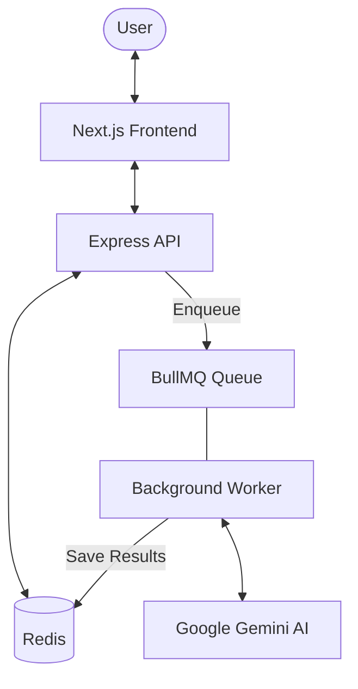

# Resume Engine 🚀

A high-performance, AI-driven ATS Resume Reviewer and Career Assistant built with **Next.js**, **Express**, **BullMQ**, and **Google Gemini AI**.


## 🌟 Key Features

- **Deep ATS Analysis**: Evaluates resume match rate against specific job descriptions using LLMs and Semantic Embeddings.
- **Asynchronous Processing**: Background job queue using **BullMQ** and **Redis** for stable, non-blocking AI tasks.
- **Smart AI Tools**:
  - **Cover Letter Generator**: High-fidelity, tailored cover letters.
  - **Interview Prep**: Predicted questions and optimal answers based on CV/JD context.
  - **Magic Fix**: AI-powered bullet point optimization for maximum impact.
- **Backend Mastery Analysis**: Specialized review for backend engineers (System Design, DB, Cloud mastery).
- **Pro-Grade Infrastructure**:
  - **Rate Limiting**: Server-side visitors tracking using FingerprintJS and Redis.
  - **Comprehensive Logging**: Structured logging with Winston.
  - **Unit & Integration Tests**: Robust test suite using Jest and Supertest.

## 🏗️ Architecture



## 🛠️ Tech Stack

- **Frontend**: Next.js 15, TailwindCSS, Motion, React Icons.
- **Backend**: Node.js, Express, TypeScript.
- **Data/Queue**: Redis, BullMQ.
- **AI**: Google Generative AI (@google/genai).
- **Testing**: Jest, Supertest.
- **Logging**: Winston.

## 🚀 Getting Started

### Prerequisites

- Node.js 20+
- Redis Server
- Gemini API Key ([Get one here](https://aistudio.google.com/))

### Installation

1. **Clone the repository**
   ```bash
   git clone https://github.com/yourusername/cv-reviewer.git
   cd cv-reviewer
   ```

2. **Setup Backend**
   ```bash
   cd backend
   npm install
   # Create .env file
   echo "GEMINI_API_KEY=your_key_here\nREDIS_URL=redis://localhost:6379" > .env
   npm run dev
   # In another terminal
   npm run worker
   ```

3. **Setup Frontend**
   ```bash
   cd ../frontend
   npm install
   npm run dev
   ```

## 🧪 Testing

```bash
cd backend
npm test
```

## 🛡️ License

MIT License. See [LICENSE](LICENSE) for details.
